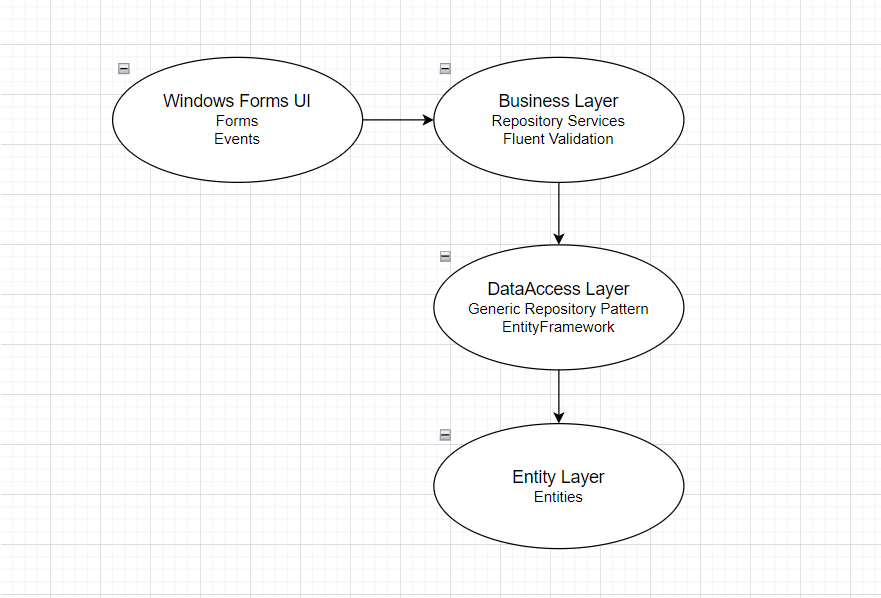

<h1>Sınav Sistemi Proje</h1>
<h3>1. Giriş</h3>

 Proje, öğrencinin kendisini test edip sınayabileceği bir sınav sistemi uygulamasıdır. Öğrenci, her dersden sınava girebilir. Bu proje sadece basit bir sınav sistemi uygulaması değildir. Geliştirilen bu uygulama, öğrenciyi analiz eder, doğru yaptığı konuları eksik kaldığı konuları tespit eder ve soruları bu doğrultuda öğrencinin karşısına getirir. Sistem, Öğrencinin kendisini daha rahat analiz edebilmesi için karşısına ise bir takım grafikler ve görsel araçlar çıkarır, buradan öğrenci eksik kaldığı kısımları daha rahat görebilir. Bu sınav sisteminde ayrıyeten öğretmen ve admin paneli de bulunmaktadır. Öğretmenler soru panelinde sorular hazırlarlar sürelerini ayarlarlar. Admin kısmında ise sistem yöneticisi öğrenci ve öğretmenlerin kayıt taleplerini onaylar ve bir takım işlemler gerçekleştirir. Ayrıntılara aşağıdan erişebilirsiniz.

<h3>2. Gereksinimler</h3>
<h4>Kullanıcı gereksinimleri</h4>
<ul>
    <li>Kullanıcı Kayıt, şifremi unuttum ve giriş bölümü olmalı</li>
    <li>Kullanıcıya ait hangi bilgiler tutulacak tanımlanmalı.</li>
</ul>
<h4>Sınav soru hazırlama gereksinimleri</h4>
<ul>
    <li>Sınav Sisteminin Hazırlanması</li>
    <li>Sorular Çoktan Seçmeli olacak (En az 4 seçenekli olacak.)</li>
    <li>Sınav Hazırlama Modülü içerisinde (textgirişi alanı olmalı [CK editör gibi yada text area gibi yada Rich Text File, Gözat butonu ile resim yükleme, sorulara ilişkin seçenekler olmalı (4 yada 5 olursa.),Doğru seçenek hangisi onun tanımlanması.])</li>
    <li>Sorular text ve resim içerebilecek</li>
    <li>Soru havuzu en az 100 sorudan oluşacak.</li>
</ul>
<h4>Sınav modülü gereksinimleri</h4>
<ul>
    <li>10 adetlik testlerden oluşan bir Quiz için sınav süresi 10 dk olacak. Öğrenci en az günde 10 soru cevaplayacak. </li>
</ul>
<h3>3. Sınav(Quiz) Sorularının Belirlenme Algoritması</h3>
<ul>
    <li>Bir soruyu hakkı ile bilmesi için altı kez üst üste doğru cevabı işaretlemesi lazım. Eğer 6 kez aynı soru için doğru cevabı vermez ise, süreç o soru için başa döner ve 6 kez aynı soru için doğru cevabı vermesi beklenir.(Öğrencinin o soruyu bilme durumunun tespit edilmesi)
    <li>Bilinen bir sorunun testte öğrenciye sorulması için kullanılacak zaman aralığı; 1 gün sonra, 1 hafta sonra,1 ay sonra,3 ay sonra,6 ay sonra ve 1 yıl sonra. Eğer 6 farklı zamanda da aynı soruyu doğru olarak bilmiş ise o zaman o soruyu soru havuzundan bilinen soru havuzuna taşınır.  
    <b>Örneğin;</b> 08.03.2022 (Çarşamba) günü(başlangıç tarihi).   İlk on soru 8,12,13,33,54,55,86,87, 19, 10 -> Bu sorulardan 8,12,86,87,19 numaralı soruları 08.03.2022 tarihinden doğru cevapladı.  
    09.03.2022 (Perşembe) günü:  Dünden bilinen sorular yani 8,12,86,87,19 numaralı sorular ile rast gele seçilen dün bildiği sorular hariç 10 soru daha soruları çözmesi için gelecek 2,5,6,78,45,14,56,57,80,81. Öğrenci dün bildiği 5 sorudan bu sefer 3 tanesini yani 8,12,87 numaralı soruları bildi ve bugün karşılatığı sorulardan 45,14,56,57,80,81 numaralı soruları bilsin.  
    ….
    15.03.2022 (Çarşamba Günü)Bir önceki haftadan bildiği sorular  8,12,87 ve dünden yani 14.03 günü itibari ile bildiği sorular ve o güne ait karşısına çıkan rastgele 10 soru üzerinden aynı mantık ile test olacak.
</ul>

<h3>4. Kullanılan Teknolojiler ve Dil</h3> Windows Forms Application(.Net Framework), EntityFramework, N-Tier Architecture, FluentValidation, MSSQL - C#
 
<h3>5. Projede Kullanılan Mimarinin Genel Hatları</h3> 

  

<h3>6. Kurulum: </h3>
 - Projede DataAccessLayer -> App.config dosyasını açınız, connectionstrings tag'i ile belirtilen connectionstring özelliğinde yer alan veritabanı bağlantı dizesini kendi veritabanı bağlantı dizenize göre güncelleyiniz. 
 - Ardından SinavSistemiProje projesine sağ tık yapıp "Set as Startup Project" deyiniz ve projeyi ayağa kaldırınız.
  
<b>Note:</b> Kullandığım Veritabanı Dosyası: SinavSistemi.bak (geliştirilen bu proje tamamen entity framework'ün code first yaklaşımı kullanılmamıştır, migration işlemleri yoktur, dolayısıyla repo'da yer alan veritabanı backup dosyasını MSSQL'e restore etmeniz gerekmektedir.)  
Geliştirdiğim proje ile ilgili içeriğe bu videodan ulaşabilirsiniz:

https://github.com/osman28tr/SinavSistemiProjeRepo/assets/83770616/b58612ea-ea55-45e2-a08e-9d66f4126645

